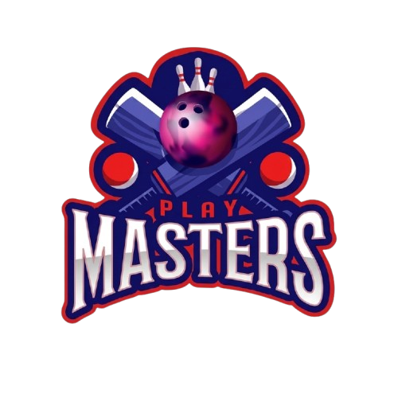

# Playmasters Kenya - UBL League Platform



A high-fidelity, data-driven web application for **Playmasters Kenya**, a premier bowling club based at Strikez, Westgate Mall, Nairobi. This platform integrates real-time UBL (Unified Bowling League) statistics, player analytics, and competitive tracking.

## 🚀 Tech Stack

- **Framework:** [Next.js 14](https://nextjs.org/) (App Router)
- **Styling:** Vanilla CSS + TailwindCSS (Glassmorphism & High-Contrast Design)
- **Database:** [Supabase](https://supabase.com/) (PostgreSQL)
- **Animations:** [GSAP](https://greensock.com/gsap/) (Cinematic Landing Page)
- **Deployment:** [Vercel](https://vercel.com/)
- **Data Pipeline:** Node.js ETL for PDF parsing (`pdf-parse`)

## ✨ Key Features

- **Cinematic Landing Page:** Premium "Nairobi" functional aesthetic with smooth GSAP animations.
- **UBL Season 16 Integration:** Automated parsing of 68+ PDF result sheets into a granular relational database.
- **Real-time Standings:** Live leaderboard aggregating wins, losses, and total pins across Monday, Tuesday, and Wednesday divisions.
- **Strategic Partners Marquee:** Dynamic scrolling display of club sponsors.
- **Authenticated Player Hub:** Secure access via Supabase Auth for detailed performance metrics.

## 🛠️ Project Structure

- `/src/app`: Next.js pages and layouts.
- `/src/components`: Reusable UI components (Hero, Marquee, Stats).
- `/scripts`: ETL pipeline for league data ingestion.
- `/supabase`: Database migrations and analytics views.
- `/public`: Static assets (Logos, Sponsor images, etc.).

## 📖 Documentation

- [ETL Pipeline Guide](scripts/README.md)
- [Database & Analytics](supabase/README.md)
- [Integration Walkthrough](docs/Integration_Walkthrough.md)

## 🏗️ Getting Started

### 1. Requirements
- Node.js 18+
- Supabase Project

### 2. Installation
```bash
npm install
```

### 3. Environment Setup
Create a `.env` file with your Supabase credentials:
```env
NEXT_PUBLIC_SUPABASE_URL=your_project_url
NEXT_PUBLIC_SUPABASE_ANON_KEY=your_anon_key
SUPABASE_SERVICE_ROLE_KEY=your_service_role_key
```

### 4. Development
```bash
npm run dev
```

---
**"Strike like Playmasters!"** 🎳💨
